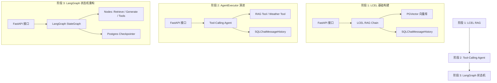

# 2026-07-15 LangChain 1.2 企业级 Agent 渐进式开发设计方案

本设计方案旨在指导如何将原 `backend` 的简单 RAG 与工具调用逻辑，升级重构为基于 **LangChain 1.2** 与 **LangGraph** 的企业级 Agent 平台，并采用**“渐进式学习与落地”**的演进路线。

---

## 1. 架构演进路线

系统将分为三个阶段进行开发与升级，从基础的 LCEL RAG 逐步演化至完备的 LangGraph 状态机智能体。



---

## 2. 数据库与向量库设计

### 2.1 数据库地址与环境
*   **宿主主机**：`59.110.139.156:5432`
*   **配置参数**：通过 `.env` 加载，遵循 `pydantic-settings` 规范。

### 2.2 阶段 1 & 2 的表结构
在此阶段，我们依然使用关系型数据库（PostgreSQL）来存储会话列表和聊天消息，同时使用标准的 `PGVector` 存储文档切片：
1.  **`files`**：记录文件 MD5 散列值与解析状态，用于去重。
2.  **`chat_sessions`** 与 **`chat_messages`**：传统表结构。使用 LangChain 的 `PostgresChatMessageHistory` 读写消息。
3.  **`langchain_pg_embedding`**：由 LangChain 官方 `PGVector` 自动生成和管理的向量数据表。

### 2.3 阶段 3 的表结构（状态统一托管）
在引入 `langgraph-checkpoint-postgres` 后：
1.  删除传统的 `chat_sessions` 和 `chat_messages` 表的直接业务写入。
2.  由 `PostgresSaver` 自动创建并维护以下状态表：
    *   `checkpoints`：状态快照。
    *   `checkpoint_writes`：图内部节点的写入日志。
    *   `checkpoint_blobs`：序列化的二进制状态数据。
3.  后端 API 直接通过 `thread_id` 从这些表中获取消息流和历史状态。

---

## 3. 规范目录结构 (`backend-langchain-v2`)

我们将在 `backend-langchain-v2` 下搭建以下符合企业级分层规范的骨架目录：

```text
backend-langchain-v2/
├── 01-课件/                  # 原始教学课件与 requirements.txt (保留)
├── app/
│   ├── api/                  # API 路由层 (v1)
│   │   ├── v1/
│   │   │   ├── endpoints/
│   │   │   │   ├── chat.py   # 核心智能体/问答对话 API
│   │   │   │   ├── files.py  # 文件解析与向量写入 API
│   │   │   │   └── sessions.py # 会话管理 API (自研 / LangGraph 包装)
│   │   │   └── router.py
│   ├── core/                 # 核心配置与日志管理
│   │   ├── config.py         # 基于 pydantic-settings 的配置加载
│   │   ├── logging.py        # Loguru 结构化日志
│   │   └── exceptions.py     # 全局异常捕获定义
│   ├── db/                   # 数据库与向量库连接池
│   │   └── connection.py     # psycopg/SQLAlchemy 异步连接配置
│   ├── models/               # 数据模型定义
│   ├── schemas/              # Pydantic 传输协议
│   ├── services/             # 核心服务逻辑 (LangChain 封装)
│   │   ├── rag_service.py    # 基于 PGVector 的文档索引与检索
│   │   └── agent_service.py  # LangChain Agent / LangGraph 的编译与执行
│   ├── tools/                # 自定义 Agent 工具注册
│   │   ├── registry.py       # 工具注册器
│   │   ├── weather.py        # 天气工具 (带 @tool)
│   │   └── geocode.py        # 定位工具 (带 @tool)
│   ├── main.py               # FastAPI 启动入口
│   └── start.sh              # 启动脚本
├── .env.example              # 环境变量配置模板
├── requirements.txt          # Python 依赖清单
└── README.md                 # 渐进式开发学习指南
```

---

## 4. 渐进式开发步骤

### 阶段 1：LCEL RAG 构建（建议耗时：2 天）
1.  **环境配置**：激活 `langchain1.2` 虚拟环境，并根据课件依赖构建 `requirements.txt`。
2.  **向量检索重构**：
    *   引入 `langchain_community.vectorstores.pgvector` 的 `PGVector` 库。
    *   重构 `rag_service.py`，实现符合 LangChain 规范的 `add_documents` 和 `as_retriever`。
3.  **LCEL 问答 Chain**：
    *   在 `agent_service.py` 中，使用 `ChatPromptTemplate` 拼装 Context。
    *   使用 `RunnablePassthrough` 形成 `retriever | prompt | llm | StrOutputParser` 的无缝检索链。

### 阶段 2：Tool-Calling Agent 落地（建议耗时：2 天）
1.  **工具标准封装**：
    *   将 `backend/app/tools` 中的天气和定位接口，使用 `langchain_core.tools.tool` 重新封装为结构化的 Tool。
2.  **Agent 自主路由**：
    *   将 RAG Retriever 包装成一个名为 `knowledge_base_search_tool` 的工具。
    *   使用 `create_tool_calling_agent` 和 `AgentExecutor`，允许 Agent 自主决定在需要时去检索本地知识库，或者去查询实时天气。

### 阶段 3：LangGraph 状态机重构（建议耗时：3 天）
1.  **图节点与状态定义**：
    *   引入 `StateGraph`，定义图的状态 `AgentState(MessagesState)`。
    *   定义 `retrieve` 节点（提取文档并暂存到状态），`generate` 节点（组装上下文提问 LLM），以及 `tools` 节点（执行工具）。
2.  **PostgreSQL 持久化**：
    *   实例化 `PostgresSaver` Checkpointer，并将其挂载到 Graph 中。
    *   改造后端 `/sessions` 接口，使之通过 `thread_id` 从 postgres saver 获取历史状态，完成企业级 Agent 闭环。
